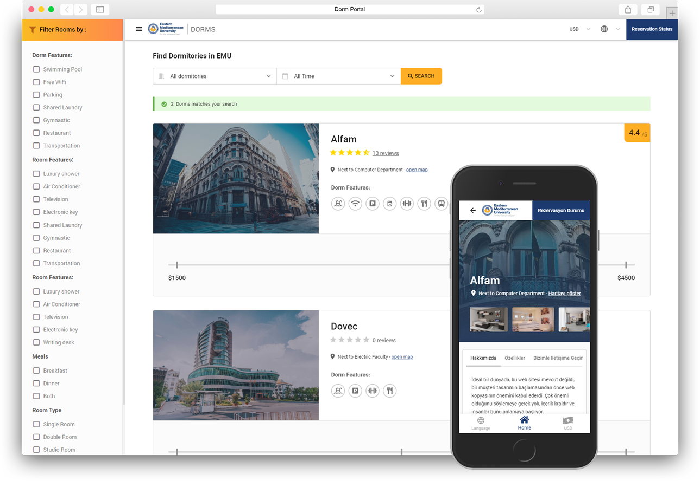

# Dorm Portal

Dormitory reservation and management system for both students and dormitory managers.

<div align="center">

</div>

## Live Demo

https://dorm-portal.herokuapp.com

## Running locally

For the API, you can simply write in your command line (this will prepare the virtual environment, migrate the db, and run the server):

```
python run.py
```

To run the SPA project:
```
yarn install
yarn run serve
```

## Deploy on Your Own Server

[Please follow this guide to deploy the system on your own server.](https://coretabs.github.io/dorm-portal/)

## Deploy on Heroku

<p align="center">
    <a href="https://heroku.com/deploy?template=https://github.com/coretabs/dorm-portal">
        
    </a>
</p>


### Seeding Database

To get up and running in a matter of seconds, simply run `python manage.py seed` to get your database seed.

### Scheduled Tasks

You will need to add both `update_rates` and `collectquota` scheduled tasks into your deployed app whether [using cron](https://askubuntu.com/a/2369) or [Heroku Scheduler](https://devcenter.heroku.com/articles/scheduler). Their job is to update the exchange rate (for currency conversion) and collect the quota (from the expired reservations), respectively.

### Uploading photos

If you are willing to use Heroku for your production app, ensure that you provide S3 backend storage to store your photos, [please refer to this guide for more information](https://simpleisbetterthancomplex.com/tutorial/2017/08/01/how-to-setup-amazon-s3-in-a-django-project.html).

## Tech stack

<p align="center">
      
</p>
