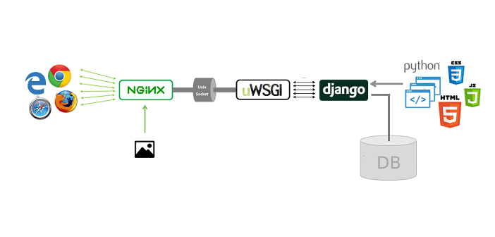
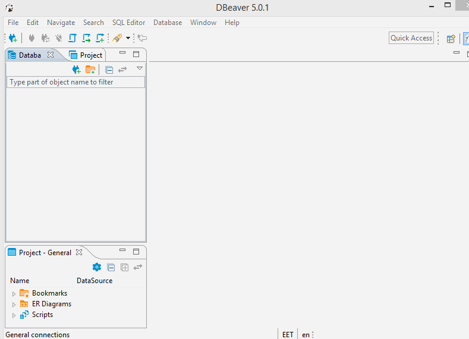

Table of Contents
---

Deployment in 5 Mins
---


Cheat Sheet
---

```
ssh -i ssh_key.pem user@yourserver.domain.com

docker exec -it $(docker ps -a | grep api | awk '{print $1}') /bin/sh
python manage.py migrate

cd /var/academy
git pull
docker-compose up --force-recreate --build -d

sudo docker rmi $(sudo docker images -f "dangling=true" -q)
```


VPS Initial Config
---

### Required Infrastructure

* Server with at least 1GB RAM and 20GB HDD (recommended specs: 2GB RAM and 40GB HDD).
* Transactional email service (like mailgun or sendgrid).
* Domain name.
* TLS/SSL certificate (for HTTPS support).

### Connect to Server (SSH)

If you are on Windows, you can use `Git Bash` to follow along:

```
ssh -i ssh_key.pem user@yourserver.domain.com
```

* `ssh_key.pem` is the SSH key file required to connect to the server
* `ubuntu` is the username
* `yourserver.domain.com` is the server DNS.

Then be the root user

```
sudo -i
```

* I will assume you know what you're doing on your server, and you will **create a specific user with the right permissions**. [You can watch this video for more info.](https://www.youtube.com/watch?v=LbJK48gvXcA&index=4&t=0s&list=PLQlWzK5tU-gDyxC1JTpyC2avvJlt3hrIh)

### Install git

```
apt install git-all
```

### Install Docker

Docker is a platform to develop, deploy, and run applications inside containers. This video gives a nice visual idea about Docker:

https://www.youtube.com/watch?v=YFl2mCHdv24

To install Docker, just simply run this command:

```
wget -qO- https://get.docker.com/ | sh
```

### Install docker-compose

docker-compose is a tool to orchestrate multiple apps in a simple manner, this guide walks you through the basics of docker-compose:

https://www.youtube.com/watch?v=Qw9zlE3t8Ko

You should see the docker-compose version after running these commands

```
apt install curl
curl -L https://github.com/docker/compose/releases/download/1.21.2/docker-compose-$(uname -s)-$(uname -m) -o /usr/local/bin/docker-compose
chmod +x /usr/local/bin/docker-compose
docker-compose --version
```

Deploying the System
---

### What folders should we have after the deployment?

Running `ls /var/dormportal` should give you:

```
app  db  media
```

* **app**: contains the dorm-portal system
* **db**: contains the database
* **media**: contains the uploaded photos to the system

### 1. Cloning

The dormitory system repository is located at: https://www.github.com/coretabs/dorm-portal

You can use `git clone` to download the repository:

```
git clone https://www.github.com/coretabs/dorm-portal /var/dormportal/app
```

You will need then to go into the clone repository directory:

```
cd /var/dormportal/app
```

### 2. Filling Environmental Variables

Environmental variables are used to configure the system before running it.

All environmental variables can be stored in two ways:

1. Inside the host machine (using export command).
2. In `.env` file.

We will use the second way for convince and to **ensure there will be no conflicts with the existing env vars** in the host machine.

To fill up your env vars, create a `.env` file using vim or nano:

```
vim /var/dormportal/app/.env
```

[Please have a look at this sample.env file to fill up your `.env`](../sample.env)

#### System Environmental Variables

| Variable | Description |
| --- | --- |
| **Database secrets** |
| POSTGRES_DB | Name of the postgres database |
| POSTGRES_USER | postgres username |
| POSTGRES_PASSWORD | postgres password |
| **Django secrets** |
| SECRET_KEY | Django secret key ([click here for more info](https://docs.djangoproject.com/en/2.2/ref/settings/#secret-key)). Preferred key length: 50 |
| DATABASE_URL | Connection string to your database (should match with your POSTGRES_DB, POSTGRES_USER, and POSTGRES_PASSWORD env vars) |
| **API configurations** |
| HOST_ENV | Defining which settings to use, `production` is the one we need here |
| DEBUG | If this is `true`, API responses will include error details |
| BASE_URL | The url of our application |
| ALLOWED_HOSTS | The allowed hosts to run this application |
| **Engine settings** |
| IS_ALWAYS_REVIEWABLE | Allow reservations to be reviewable just after the reservation has been made (for development purposes) |
| LANGUAGES | The system languages |
| **Email settings** |
| DEFAULT_FROM_EMAIL | Email sender |
| EMAIL_HOST | SMTP server DNS |
| EMAIL_HOST_USER | SMTP username |
| EMAIL_HOST_PASSWORD | SMTP password |

#### Changing environmental variables

After changing the `.env` file, you will just need to [rebuild the containers using docker-compose](#rebuild-all-containers).

### 3. Configuring NGINX

Nginx is a web server which can also be used as a reverse proxy, load balancer, mail proxy and HTTP cache, [more on NGINX in this video.](https://www.youtube.com/watch?v=ng5DsxYp-Bk)


*Original picture: https://www.vndeveloper.com/django-behind-uwsgi-nginx-centos-7/*

We use it for two main purposes:

1. As a reverse proxy to the Django app.

2. Serve photos (since the Django app cannot handle huge load).

#### HTTPS and WWW redirection

NGINX is configure to redirect to https and www domain in [`nginx.conf`](../nginx.conf) file

```
if ($host !~ ^www\.) {
    rewrite ^ https://www.$host$request_uri permanent;
}
```

By deleting these lines, you will be able to enter the app from http (not recommended).


You can use vim to edit the file

```
vim /var/dormportal/app/nginx.conf
```

### 4. Change API URL

The API URL which the frontend uses can be located in [`backend.js`](../src/backend.js)

```
baseURL: 'http://127.0.0.1:8000/api',
```

Change this into the domain name that you have (**use https if needed**), for example:

```
baseURL: 'http://dorm.mydomain.com/api',
```

You can use vim to edit the file

```
vim /var/dormportal/app/src/backend.js
```

### 5. Running the System

This command will let docker-compose build all containers at once

```
docker-compose up -d
```

### 6. Sanity Check

After running the containers, you can check the status of the containers by

```
docker ps
```

You should get

```
CONTAINER ID        IMAGE                 COMMAND                  CREATED             STATUS              PORTS                    NAMES
90d3db177ccd        nginx:1.15.3-alpine   "nginx -g 'daemon of…"   5 mins ago        5 mins ago         0.0.0.0:80->80/tcp       production_nginx
6f2da3fdeb18        app_api              "sh -c 'crond && gun…"   5 mins ago        5 mins ago         0.0.0.0:8000->8000/tcp   app_api_1
dc42ac4cd1d1        postgres              "docker-entrypoint.s…"   5 mins ago        5 mins ago         0.0.0.0:5432->5432/tcp   app_db_1
```

This means that you have the three required containers (postgres, nginx, and the app).

* You will need to open 80 port in your inbound rules (in your server security settings).

* In case there was a missing container, try to [rebuild it as explained here.](#rebuild-a-specific-container)

Configuring the Database
---

#### Getting inside the Django app container

To run commands inside the Django app container you need to get inside that container first

```
docker exec -it $(docker ps -a | grep api | awk '{print $1}') /bin/sh
```

Now you're in the shell of that container.


### Migrating and Seeding Database

The database needs to be seeded before you can enter the website

```
python manage.py migrate
```

There are also required records that need to be seeded into the database

```
python manage.py seed
```

### What Are the Required Records in the Database?

The required records are the 4 basic filters used by the filtering engine:

```
Category (Public/Private)
Allowed people number in one room
Reservation Duration (Spring/Winter/Summer/Full Year)
Price
```

### Adding Admin User

To login into the admin panel which is located at

```
http://dorm.mydomain.com/api/admin
```

So, to add the admin user run this command

```
echo "from api.engine.models import User; User.objects.create_superuser('admin', 'admin@example.com', 'admin')" | python manage.py shell
```

This will add an `admin` user with `admin` password (**do NOT forget to change the credentials later from Django admin**).

Containers Management
---

### What Containers Do We Have?

We have 3 containers:

1. **postgres**: database container.
2. **api**: dormitory system container.
3. **nginx**: nginx container.

### Listing Containers

```
docker ps
```

### Checking Container's Logs

Sometimes your container might fail to start, so you will need to read the logs.

First, you need to list all containers with `-a` flag (or --all). This will show all containers (even stopped ones).

```
docker ps -a
```

Then, simply take the first 4 characters of the container ID and put it into this command

```
docker logs <id>
```

### Going into Container's Shell

If you wanna go inside a container, you can use `docker exec` command. Since we use Alpine Linux, we need to run `/bin/sh`

```
docker exec -it <id> /bin/sh
```

* **-i**: interactive.
* **-t**: tty.

### Stopping All Containers

To stop any container (say a hanging container)

```
cd /var/dormportal/app
docker-compose stop
```

### Rebuild All Containers

```
docker-compose up --force-recreate --build -d
```

### Rebuild a Specific Container

You have to first go into the folder of the dorm portal app

```
cd /var/dormportal/app
```

And, you can rebuild any of the 3 containers we have `postgres`, `api`, and `nginx`

To rebuild the nginx container

```
cd /var/dormportal/app
docker-compose up --force-recreate --build -d nginx
```

### Clean up Space

You can delete docker dangling images by

```
docker rmi $(sudo docker images -f "dangling=true" -q)
```

### Resources Usage

To  display the containers' resource usage

```
docker stats
```

Upgrading the System
---

Since we use git, upgrading the system is just a matter of pulling the repository & rebuilding the container

```
cd /var/dormportal/app
git pull
docker-compose up --force-recreate --build -d
```

Database Management
---

### What's the used database?

We use **PostgreSQL** since it has greater support with Django.

### Getting into the database container

To perform any operation on the database, you would need to get inside the postgres container

```
docker exec -it $(docker ps -a | grep db- | awk '{print $1}') /bin/sh
psql dorm_db -U dorm_user
```

### Backup Database

Inside the postgres container you simply run `pg_dump` like this

```
docker exec -it $(docker ps -a | grep db- | awk '{print $1}') /bin/sh
pg_dump -U dorm_user -Fc dorm_db > /var/lib/postgresql/data/my_backup.dump
```

* Do NOT forget to use your db credentials in the command above

Then copy the file to your local machine via `scp` ([Secure File Copy](https://www.ssh.com/ssh/scp/))

```
scp -i ssh_key.pem user@yourserver.domain.com:/var/dormportal/db/my_backup.dump .
```

### Restore Database

First copy the dumb into the server

```
scp -i ssh_key.pem ./my_backup.dump user@yourserver.domain.com:/home/user/my_backup.dump
```

* Do NOT forget to change `/home/user/` into your server username

Then get into the server via ssh

```
ssh -i ssh_key.pem user@yourserver.domain.com
```

And restore the db

```
sudo -i
cp /home/user/my_backup.dump /var/dormportal/db/my_backup.dump

docker exec -it $(docker ps -a | grep db | awk '{print $1}') /bin/sh

dropdb -U dorm_user dorm_db
createdb -U dorm_user dorm_db --template=template0 --owner=dorm_user
pg_restore -U dorm_user -d dorm_db --clean /var/lib/postgresql/data/my_backup.dump
```


#### Backup Photos

Dormitory photos are located in `/var/dormportal/media` folder, you can copy it locally using scp

```
mkdir ./media
scp -r -i ssh_key.pem user@dorm.mydomain.com:/var/dormportal/media ./media
```

### Database Migrations

Doing migrations is the responsbility of the Django app, so you need to enter the Django app container first, then apply migrations

```
docker exec -it $(docker ps -a | grep api | awk '{print $1}') /bin/sh
python manage.py migrate
```

### Connecting to Database using DBeaver

In some scenarios, you might need to connect to the db using a SQL client, such as DBeaver, and perform SQL queries on it

The first thing you will need is to **allow inbound rules** for `port 5432`

* Do NOT forget to close that port after you finish as it exposes your database to the internet.

Then connect to your database as shown below



Now, you can perform any queries on the database.

cron Jobs
---

### What is cron?

cron is a time-based job scheduler in Unix-like computer operating systems.

### What are the scheduled jobs?

There are two schedule jobs:

1. Update exchange rates (for currency conversion).
2. Collect quotas from non-finished reservations (efficient way to ensure non-paid reservations are cleaned up).

### Configure cron jobs

The [`Dockerfile`](../Dockerfile) contains the cron job configuration for both jobs:

```
RUN crontab -l | { cat; echo "0 */2 * * * cd /dormportal/app; python manage.py collectquota && python manage.py update_rates"; } | crontab -
```

The `0 */2 * * *` means that it will run every two hours, you can use this website if you wish to change this value:

[https://crontab.guru](https://crontab.guru/#0_*/2_*_*_*)